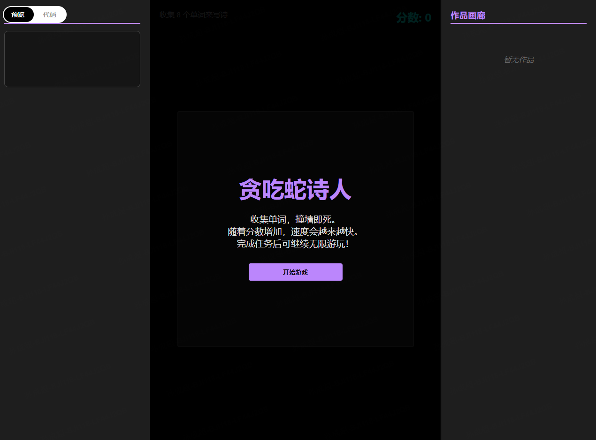
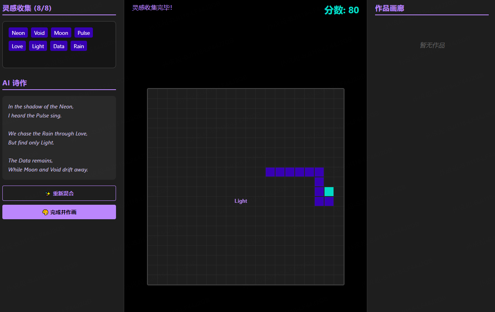
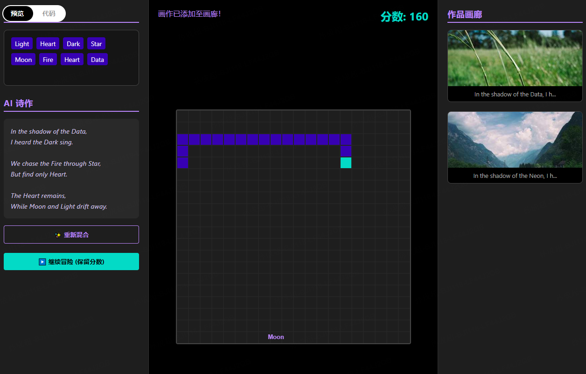

# prompt

[chat.z.ai](https://chat.z.ai) 
```
p1 
帮我做一个贪吃蛇游戏：
1. 用方向键控制蛇的移动（四个方向-上下左右）
2. 吃到食物后蛇会变长，分数增加（有时候会同时出现2个食物，其中一个是有毒蘑菇，会变短身体并减分）
3. 撞到墙壁或自己的身体就游戏结束
4. 要有开始和重新开始按钮
5. 界面要简洁好看

-----------------------------------
p2
蛇的速度一开始比较慢，分数越高速度越快

-----------------------------------
p3
我可以吃不同的单词，它们会被收集在一个盒子里
当蛇吃了8个单词时，llm 应该根据这些单词创作一首诗，我们可以根据需要重新混合这首诗。
当诗完成后，下一步将自动根据这首诗创建一幅图像。

-----------------------------------
p4
还需要额外增加一些元素
1. 同时保持分数增加，撞到墙壁或自己的身体就游戏结束
2. 有三个框，左边为收集框和生成的诗； 中间为游戏主体；右边为生成的图片，展示最近3张


-----------------------------------
p5
实现出现一些问题了！！

蛇的长度一开始是比较短的，吃了单词增加一点点长度。
同时速度是随着吃的数量慢慢慢慢慢慢加快的

-----------------------------------
p6
生成完成后，可以点击继续，游戏界面弹出是否继续游戏按钮，继续则继续游戏
```


# 生成结果






