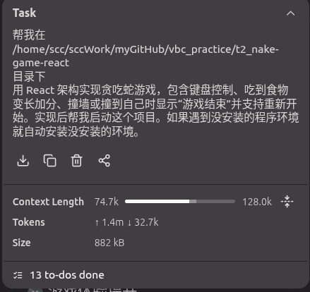
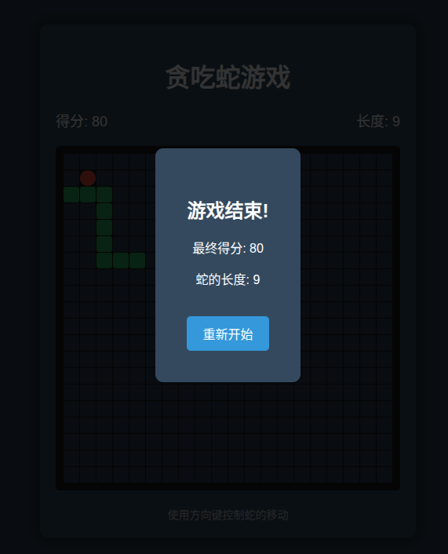
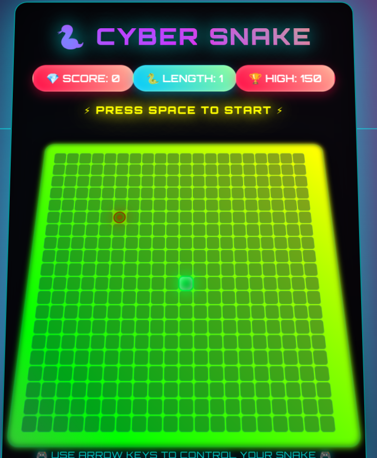
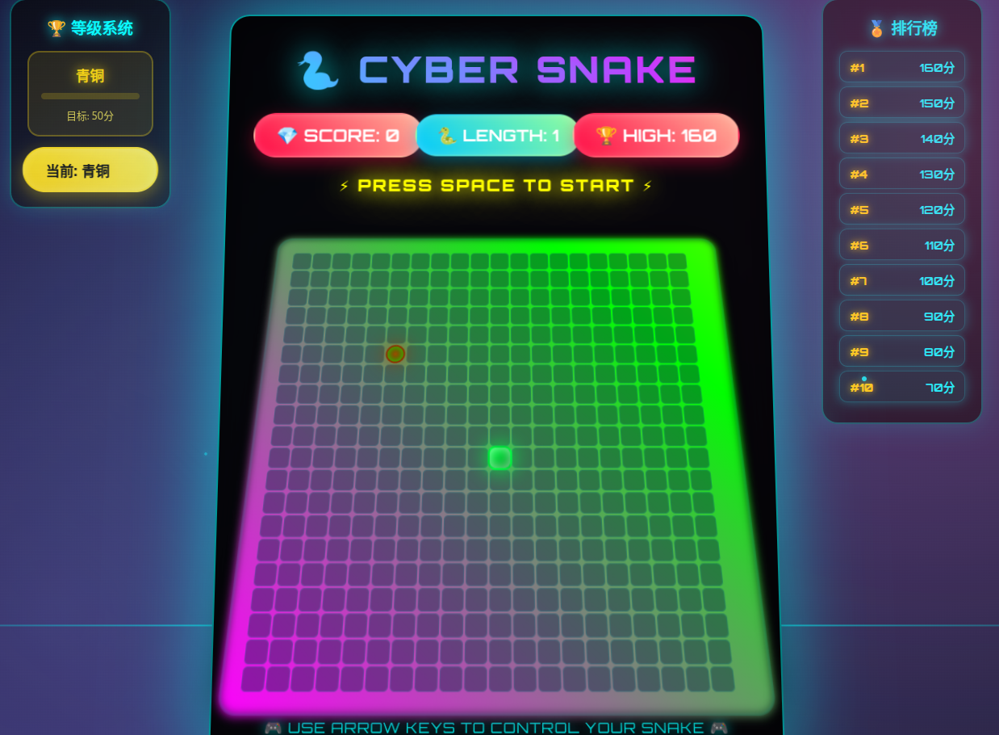
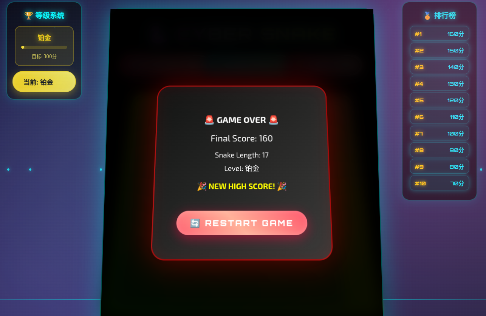

# 🐍 赛博朋克贪吃蛇 | Cyber Snake Game

一个使用 React 和 TypeScript 构建的赛博朋克风格贪吃蛇游戏，具有等级系统和排行榜功能。

## vbc 
RooCode + `kimi-for-coding`
```
prompt1
帮我在 
xxxx/t2_nake-game-react 
目录下
用 React 架构实现贪吃蛇游戏，包含键盘控制、吃到食物变长加分、撞墙或撞到自己时显示"游戏结束"并支持重新开始。实现后帮我启动这个项目。如果遇到没安装的程序环境就自动安装没安装的环境。

prompt2 
帮忙把这个页面做的更加酷炫一些

prompt3
右边再加上一个分数排行版，左边可以显示当前等级（等级随分数逐渐上升），青铜-白银-铂金-钻石-星耀-蛇神
```




## ✨ 功能特性

### 🎮 核心游戏功能
- 🐍 经典贪吃蛇游戏玩法
- 🎮 键盘方向键控制
- 🍎 吃到食物变长加分
- 💥 撞墙或撞到自己时游戏结束
- 🔄 游戏结束后支持重新开始
- 📊 实时显示得分和蛇的长度

### 🏆 等级系统
- **青铜** → **白银** → **铂金** → **钻石** → **星耀** → **蛇神**
- 等级随分数自动提升
- 每个等级都有独特的颜色主题
- 进度条显示当前等级进度

### 🏅 排行榜功能
- 实时记录前10名高分
- 自动排序和更新
- 显示排名和分数

### 🎨 视觉效果
- 赛博朋克主题设计
- 霓虹发光效果
- 动态背景和粒子系统
- 3D透视和动画效果
- 扫描线效果

## 🎮 游戏控制

- **方向键**: 控制蛇的移动方向
- **空格键**: 开始游戏
- **重新开始按钮**: 游戏结束后点击重新开始

## 📋 游戏规则

1. 使用方向键控制蛇的移动
2. 吃到红色食物可以增长蛇身并获得分数
3. 撞墙或撞到自己的身体时游戏结束
4. 随着分数增加，等级会自动提升
5. 游戏结束后可以点击"重新开始"按钮重新开始游戏

## 🏆 等级系统详解

| 等级 | 所需分数 | 颜色主题 |
|------|----------|----------|
| 青铜 | 0分 | 青铜色 |
| 白银 | 50分 | 银白色 |
| 铂金 | 150分 | 铂金色 |
| 钻石 | 300分 | 钻石蓝 |
| 星耀 | 500分 | 星耀紫 |
| 蛇神 | 800分 | 黄金色 |

## 💻 技术实现

- **React 18**: 使用最新的 React 版本和 Hooks
- **TypeScript**: 类型安全的开发体验
- **CSS Grid**: 游戏板网格布局
- **键盘事件处理**: 实时响应用户输入
- **游戏循环**: 使用 setInterval 实现游戏动画
- **本地存储**: 排行榜数据本地保存

## 📁 文件结构

```
t2_nake-game-react/
├── index.html          # 主游戏文件（包含所有代码）
├── package.json        # 项目配置
└── README.md          # 项目说明
```

## 🚀 运行游戏

由于这是一个单文件 React 应用，你可以直接在任何现代浏览器中打开 `index.html` 文件来运行游戏。

或者使用 Python 的 HTTP 服务器：

```bash
python3 -m http.server 3000
```

然后在浏览器中访问 `http://localhost:3000`

## 🎯 游戏界面

游戏界面包含：
- **左侧**: 等级系统显示，显示当前等级和进度条
- **中间**: 20x20 的游戏网格，绿色的蛇身，红色的食物
- **右侧**: 排行榜，显示前10名高分
- **顶部**: 实时得分、蛇的长度和历史最高分
- **游戏结束**: 弹窗显示最终成绩和等级

## ⚙️ 自定义配置

你可以在代码中修改以下参数：

- `BOARD_SIZE`: 游戏板大小（默认 20）
- `GAME_SPEED`: 游戏速度（默认 120ms）
- `levelSystem`: 等级系统配置
- 排行榜最大记录数

## 🎮 游戏截图

- 第一版
  - 
- 第二版
  - 
- 第二版Plus 
  - 
  - 


享受这个充满赛博朋克风格的贪吃蛇游戏吧！🎮✨