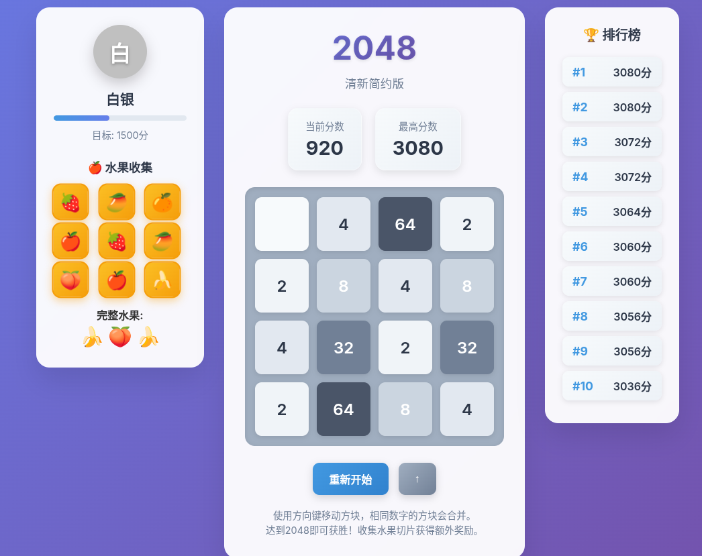
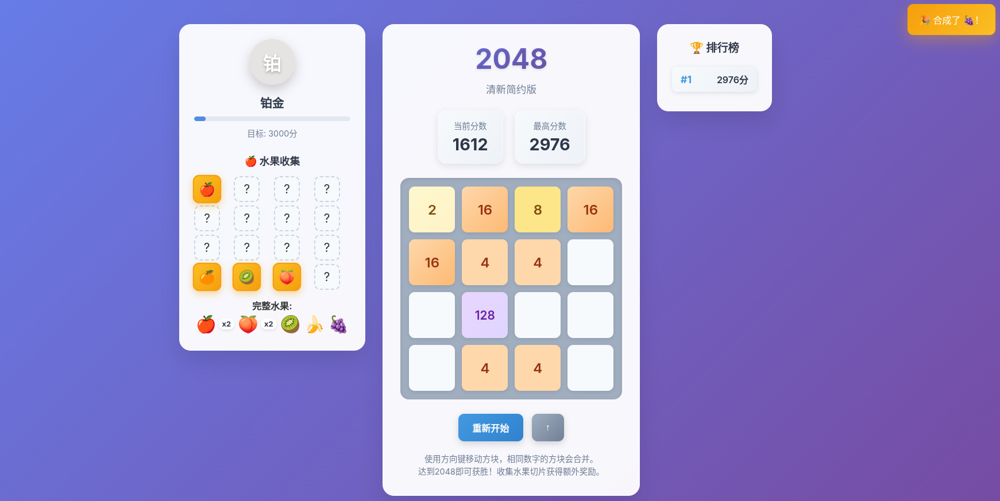

# 🍀 2048 清新版游戏

一个基于React开发的2048游戏，采用简约清新的设计风格，包含等级系统、水果收集和排行榜功能。

## prompt 
```
p1
帮我在 
/home/scc/sccWork/myGitHub/vbc_practice/t2_new-game-react
目录下用 React 架构实现 2048 小游戏（简约清新风格）

右边再加上一个分数排行版，左边可以显示当前等级（等级随分数逐渐上升），青铜-白银-铂金-钻石-星耀-超神

左边等级的下面还会激活一些水果切片的图标，达到一定分数会随机激活一个，同时三个相同水果片激活，会合成一个完整的水果，同时放在 等级徽章的下面

p2
帮忙做以下3点优化：
1. 排行版只有在游戏结束的时候才增加上去，
2. 水果收集系统点亮3个一样的片后在格子里消失，并在下方生成一个完整的水果，如果最这次了n个同意的水果用， 水果图标x N表示
3. 2048主体游戏色调可以亮一些，同时合成的时候增加一点点特效


p3
还需要优化下：
1. 左边的水果系统重新开始的时候需要重置
2. 左边的水果系统可以改成4*4的，当页面充满无法消除相同的三个的时候，随机删除3个空格。
3. 2048游戏方块颜色可以淡一点
```

## 🎮 游戏特色

### 核心功能
- **经典2048玩法**: 使用方向键移动方块，相同数字合并
- **清新UI设计**: 简约现代的界面风格，舒适的视觉体验
- **响应式设计**: 支持桌面和移动设备

### 等级系统
- **六个等级**: 青铜 → 白银 → 铂金 → 钻石 → 星耀 → 超神
- **动态进度**: 实时显示当前等级进度
- **分数要求**: 每个等级都有相应的分数门槛

### 水果收集系统
- **随机收集**: 游戏过程中有概率获得水果切片
- **合成机制**: 三个相同的水果切片可合成完整水果
- **额外奖励**: 合成完整水果获得100分奖励
- **视觉反馈**: 精美的水果图标和动画效果

### 排行榜功能
- **实时记录**: 自动保存最高分数记录
- **前十名**: 显示历史最高分排行榜
- **持久存储**: 分数数据本地保存

## 🚀 快速开始

### 本地运行
```bash
# 进入项目目录
cd t2_new-game-react

# 启动本地服务器
npm start
# 或使用Python
python3 -m http.server 3001

# 在浏览器中打开
# http://localhost:3001
```

### 文件结构
```
t2_new-game-react/
├── index.html          # 主游戏文件
├── package.json        # 项目配置
└── README.md          # 项目说明
```

## 🎯 游戏玩法

### 基本操作
- **方向键**: ↑ ↓ ← → 控制方块移动
- **重新开始**: 点击重新开始按钮
- **触屏支持**: 移动设备上支持滑动操作

### 游戏目标
- **基础目标**: 合成出2048方块
- **等级提升**: 达到指定分数提升等级
- **水果收集**: 收集并合成各种水果
- **高分挑战**: 挑战排行榜前十名

### 得分规则
- **合并得分**: 每次合并获得相应数字的分数
- **水果奖励**: 合成完整水果获得100分
- **等级奖励**: 达到新等级时获得额外奖励

## 🎨 设计特色

### 视觉设计
- **渐变背景**: 优雅的紫色渐变背景
- **毛玻璃效果**: 现代化的毛玻璃界面元素
- **动画效果**: 流畅的过渡动画和交互反馈
- **色彩系统**: 精心设计的色彩层次和对比度

### 用户体验
- **即时反馈**: 操作后立即显示结果
- **成就提示**: 重要时刻的弹窗提示
- **进度显示**: 清晰的等级和分数进度
- **响应式布局**: 适配各种屏幕尺寸

## 🏆 等级说明

| 等级 | 分数要求 | 颜色 | 特点 |
|------|----------|------|------|
| 青铜 | 0分 | 🟤 古铜色 | 初始等级 |
| 白银 | 500分 | ⚪ 银色 | 初级玩家 |
| 铂金 | 1500分 | 🔘 铂金色 | 中级玩家 |
| 钻石 | 3000分 | 🔷 钻石蓝 | 高级玩家 |
| 星耀 | 5000分 | 🟣 星耀紫 | 专家级 |
| 超神 | 8000分 | 🟡 金色 | 大师级 |

## 🍎 水果系统

### 可收集水果
- 🍎 苹果 - 🍌 香蕉 - 🍊 橙子
- 🍇 葡萄 - 🍓 草莓 - 🥝 猕猴桃
- 🍑 樱桃 - 🥭 芒果

### 收集规则
- **随机掉落**: 每次有效移动有30%概率获得水果切片
- **合成条件**: 三个相同水果切片自动合成
- **奖励机制**: 合成完整水果获得100分奖励
- **视觉展示**: 完整水果显示在等级徽章下方

## 🔧 技术实现

### 核心技术
- **React 18**: 现代化的React开发
- **CSS3**: 先进的样式和动画效果
- **ES6+**: 现代JavaScript语法
- **CDN引入**: 无需构建步骤，直接运行

### 关键功能实现
- **游戏逻辑**: 完整的2048算法实现
- **状态管理**: React hooks管理游戏状态
- **事件处理**: 键盘和触摸事件支持
- **本地存储**: 分数和排行榜数据持久化

## 🌟 未来计划

### 功能扩展
- **更多游戏模式**: 时间挑战、步数限制等
- **社交功能**: 分享成绩、好友排行榜
- **主题系统**: 多种视觉主题可选
- **音效系统**: 游戏音效和背景音乐

### 技术优化
- **性能优化**: 更流畅的动画和响应
- **PWA支持**: 离线游戏能力
- **数据同步**: 云端数据同步
- **多语言**: 国际化支持

## 📱 兼容性

### 浏览器支持
- Chrome 80+
- Firefox 75+
- Safari 13+
- Edge 80+

### 设备支持
- 桌面端: 完整功能支持
- 平板端: 优化触摸体验
- 手机端: 适配小屏幕

## 🤝 贡献指南

欢迎提交Issue和Pull Request来改进游戏！

### 开发建议
- 保持代码简洁易懂
- 遵循React最佳实践
- 注重用户体验优化
- 考虑性能影响因素

## 📄 许可证

MIT License - 详见 [LICENSE](LICENSE) 文件

---

**享受游戏，挑战高分！** 🎮✨


## 游戏截图

- 第一版
  - 
- 第二版
  - 

