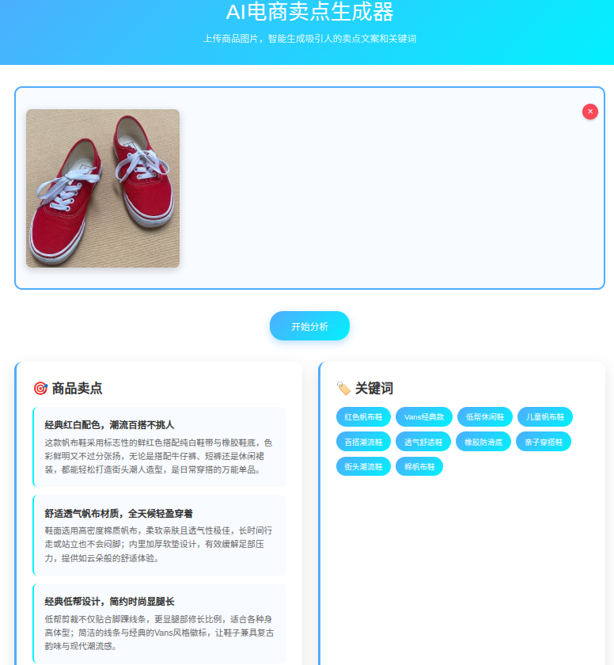

# AI电商卖点生成器

基于阿里云大模型API，实现上传图片自动生成电商卖点文本和关键词的Web应用。

## 功能特点

- 🖼️ 支持图片上传（拖拽或点击）
- 🤖 AI智能分析商品图片
- 📝 自动生成3-5个商品卖点
- 🏷️ 提取10个相关关键词
- 💫 简洁清新的界面设计
- 📱 响应式布局，支持移动端

## 技术栈

- **后端**: FastAPI + Python
- **前端**: 原生HTML/CSS/JavaScript
- **AI模型**: 阿里云通义千问VL模型 (qwen3-vl-flash)
- **部署**: Uvicorn服务器

## 快速开始

### 1. 环境准备

```bash
# 进入项目目录
cd t4_power_ai

# 安装依赖
cd backend
pip install -r requirements.txt
```

### 2. 配置API密钥

编辑 `.env` 文件，添加你的阿里云API密钥：

```
ALI_API_KEY=your_api_key_here
```

### 3. 启动服务

```bash
# 启动后端服务
python main.py
```

服务将在 `http://localhost:8000` 启动

### 4. 使用应用

1. 打开浏览器访问 `http://localhost:8000`
2. 上传商品图片（支持拖拽）
3. 等待AI分析生成卖点和关键词
4. 查看生成的电商文案

## API接口

### 图片分析接口

**POST** `/api/analyze-image`

**请求参数**:
- `file`: 图片文件（multipart/form-data）

**响应格式**:
```json
{
  "success": true,
  "image_url": "/uploads/filename.jpg",
  "analysis": {
    "selling_points": [
      {
        "title": "卖点标题",
        "description": "详细描述"
      }
    ],
    "keywords": ["关键词1", "关键词2", ...]
  }
}
```

## 项目结构

```
t4_power_ai/
├── backend/
│   ├── main.py          # FastAPI主应用
│   └── requirements.txt # Python依赖
├── .env                 # 环境变量配置
└── README.md           # 项目说明
```

## 注意事项

- 确保已配置正确的阿里云API密钥
- 支持JPG、PNG、GIF格式图片
- 单张图片大小限制为10MB
- 需要网络连接以调用AI服务

## 阿里云API配置

本项目使用阿里云DashScope平台的通义千问VL模型，配置信息：

- **Base URL**: `https://dashscope.aliyuncs.com/compatible-mode/v1`
- **模型名称**: `qwen3-vl-flash`
- **API文档**: [阿里云DashScope文档](https://help.aliyun.com/document_detail/2712586.html)

## 许可证

MIT License

## prompt

```
P1: 
新起一个AI项目（项目目录：./vbc_practice/t4_power_ai）

帮我们实现将上传的图片，自动生成电商卖点文本、关键词的功能 
不用太复杂！！，只需要
1- 上传图片
2-  大模型解析图片：自动生成电商卖点文本、关键词
3- 页面简洁清新点

基于下面的图生文接口 API
api_key=os.getenv("ALI_API_KEY")
ALI_BASE_URL=https://dashscope.aliyuncs.com/compatible-mode/v1 
MODEL_NAME=qwen3-vl-flash

P2:
前端页面布局调整下
1. 点击拖拽图片，上传后，图片固定在同个位置，可以点击叉删除图片
2.  边上添加按钮，开始分析。点击之后才调用大模型
3. 商品卖点 和 关键词 并列一排
```

## 页面图示

